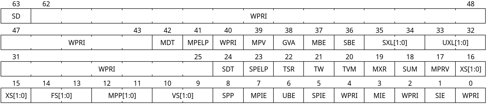

# Lab 0 - Booting the mini-kernel

Make sure you've completed the instructions in README.md for building
and booting the OS, then read the [Theoretical overview](#theoretical-overview)
and [Lab preliminaries](#lab-preliminaries) sections to get an overview of what
you will be doing.
Finally, follow the [Lab Instructions](#lab-instructions) to complete the
assignment. Good luck!

# Theoretical verview

## What is a kernel?

The kernel is the piece of software within the operating system that is
responsible for providing an interface between the user applications and the
underlying machine hardware. There is a hardware-enforced logical separation
between user applications, which run on a lower-privilege environment called
*userspace*, and the kernel code, which runs in *kernel space*. The kernel
carries the following responsibilities:

- Managing the access to hardware devices, such as your mouse, keyboard,
  storage, GPUs, etc, and providing an API for userspace to access them
  securely
- Managing the access to *physical memory* (e.g. RAM), both for the userspace
  and the kernel through an abstraction called *virtual memory*
- Managing the access to *CPU time* through a so-called *scheduler* (that
  decides which tasks get to run and for how long before yielding the CPU to
  other higher priority tasks) 

## RISC-V privilege modes

In order to create the userspace vs. kernel separation mentioned above,
modern operating systems generally rely on the concept of *privilege levels*
(enforced by hardware) to separate between kernel code (higher privilege) and
userspace code (lower privilege). For RISC-V, there are three privilege modes, defined in the
[RISC-V Privileged ISA manual](https://riscv.github.io/riscv-isa-manual/snapshot/privileged/), 
[section 1.2](https://riscv.github.io/riscv-isa-manual/snapshot/privileged/#_privilege_levels):

- **Machine (M) mode**: the highest privilege mode, generally reserved to
  firmware, encoded by `11`
- **Supervisor (S) mode**: the second-highest privilege mode, in which the
  kernel usually runs, encoded by `01`
- **User (U) mode**: the lowest privilege mode, in which userspace code
  runs, encoded by `00`

For simplicity, QEMU will start our kernel code in M-mode (which is not
the [standard way](https://github.com/riscv-software-src/opensbi) but
will suffice for our purposes). As such, one of the first tasks we have
to accomplish before doing anything useful is **switching to S-mode**;
this will be your task for this initial lab assignment.

# Lab preliminaries

## Objective

The objective of this lab will be to follow a sequence of steps to
transition from M-mode into S-mode. You will learn how to configure a
RISC-V processor by tweaking *Control and Status Registers* (CSRs),
as well as some idiomatic bitwise operation tricks commonly used for
register configuration (also known as *bit banging*).

## Becoming familiar with the codebase

The basic boilerplate code is currently structured as follows
(unimportant files ommitted for brevity):

```
├── include (kernel headers)
│   ├── arch
│   │   └── csr.h (CSR access helpers)
│   └── kernel
│       └── printf.h (header for our printf implementation)
├── linker.ld (kernel linker script)
└── src
    ├── entry.S (M-mode assembly bootstrap code)
    ├── kernel.c (S-mode startup code)
    ├── printf.c (a tiny printf implementation)
    └── startup.c (M-mode startup code)
```

In this lab you will be modifying `include/arch/csr.h` and `src/startup.c`. Try
to have a cursory glance at all the files and become familiar with their
purpose. Don't worry about understanding all of them thoroughly at this point.

## Learning to navigate the RISC-V Privileged ISA manual

Become familiar with the 
[RISC-V Privileged ISA manual](https://riscv.github.io/riscv-isa-manual/snapshot/privileged/), 
since a lot of the work in this semester will involve searching through the manual. If you have
the time, try to give Sections 1 (Introduction) and 2 (Control and Status Registers) a look.

## Register configuration and bitwise operations

The RISC-V Control and Status Registers (CSRs) are a set of 4096 **64-bit**
registers that are accessed through the `csrr` (read), `csrw` (write) and
others instructions. Each CSR has its own unique number (from 0 to 4095).

As an example, `mstatus` CSR has the number: `0x300` (found
[here](https://riscv.github.io/riscv-isa-manual/snapshot/privileged/#mcsrnames)).
And it contains various important knobs to configure a RISC-V processor, its 64
bits are divided as below:



The assembly code to read from this CSR into `a0` would be:

```asm
csrr mstatus, a0
```

Whereas writing the value stored in `a0` would be:

```asm
csrw mstatus, a0
```

Generally we don't want to be writing assembly by hand, instead we provided
`csr_read`/`csr_write` macros inside `include/arch/csr.h` that allow accessing
CSRs in similarly to calling regular C functions; for example, reading
`mstatus` could look like the following:

```c
#define CSR_MSTATUS 0x300

    // somewhere in the code...
    uint64_t mstatus = csr_read(CSR_MSTATUS);
    // ...

```

Notice how we used the `uint64_t` type (provided by `<stdint.h>`) to store the
value of the 64-bit register. Additionally, instead of writing down the CSR
number (`0x300`) directly, we created a macro to improve readability.

When configuring things in registers, we generally want to write things to
a *bit field*; for example, the `MPP` field (bits 11 and 12) in `mstatus`
control which privilege level we will go to when leaving M-mode. For this lab,
we would like to set this field to `01` (S-mode). The idiomatic way to do this
in C is to define a **bit mask** for the field, e.g.:

```c
#define CSR_MSTATUS_MPP (1ULL << 12) | (1ULL << 11)
```

we can use this mask to **clear** (e.g. write zeroes) the bitfield by doing

```c
mstatus &= ~CSR_MSTATUS_MPP;
```

Notice that the logic behind this is the following:

```
CSR_MSTATUS_MPP  = 0b00000000000000000001100000000000
~CSR_MSTATUS_MPP = 0b11111111111111111110011111111111

mstatus          = 0bXXXXXXXXXXXXXXXXXXXXXXXXXXXXXXXX
   &
~CSR_MSTATUS_MPP = 0b11111111111111111110011111111111
-----------------------------------------------------
                 = 0bXXXXXXXXXXXXXXXXXXX00XXXXXXXXXXX
```

We can then set the value we want to that field by doing, e.g.,

```c
#define CSR_MSTATUS_MPP_S (1ULL << 11)
mstatus |= CSR_MSTATUS_MPP_S;
```

We could then write the value we just calculated back into the `mstatus`
register by doing:

```c
csr_write(CSR_MSTATUS, mstatus);
```

## S-mode handover process

Using the `csr_read` and `csr_write` macros defined in
`include/arch/csr.h`, you can follow the process above to configure
the following CSRs inside the `mmode_startup` function (`src/startup.c`):

- `mstatus`: set the `MPP` field to `01` (the encoding for S-mode)
    - This ensures we enter S-mode after leaving M-mode
- `mepc`: set it to the address of `kmain`
    - Make the CPU jump to `kmain` when leaving M-mode
- `satp`: write `0`
    - Disable paging (we will learn what this means in the future)
- `medeleg`: write `0xFFFFFFFFFFFFFFFF`
    - Delegate all exceptions to the S-mode kernel
- `mideleg`: write `0xFFFFFFFFFFFFFFFF`
    - Delegate all interrupts to the S-mode kernel
- `pmpcfg0`: write `0xf` to the register
    - Give the S-mode kernel access to the entire physical memory
- `pmpaddr0`: write `0x3FFFFFFFFFFFFFFF`
    - Give the S-mode kernel access to the entire physical memory

Finally, call the `mret` instruction to attempt to switch over to S-mode.
You can do that by using *inline assembly* as follows:

```c
__asm__ __volatile__("mret");
```

Seeing the `successfully entered S-mode` message (from `kmain` in
`src/kernel.c`) means you have successfully completed the assignment. :-)

# Lab instructions

Your assignment is to implement code in `src/startup.c` and `include/arch/csr.h`
to successfully transition the kernel from M-mode to S-mode by following the
[detailed step-by-step process](#s-mode-handover-process) described above.

There is an [automated script](./grader.sh) that you can run yourself to
evaluate your solution; it is the same script that the autograder will run
every time you commit/push to the repo.

Good luck!
